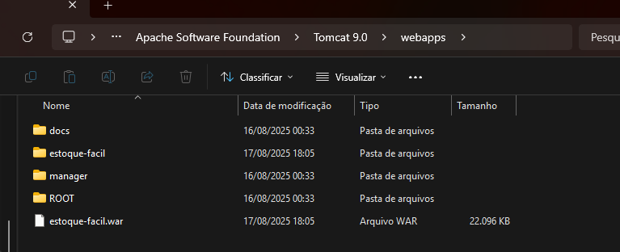

# Estoque Fácil

Sistema de Controle de Estoque desenvolvido em Java EE com interface moderna e funcionalidades avançadas de gestão de produtos, usuários e pagamentos.

## Visão Geral

O **Estoque Fácil** é uma aplicação web completa para controle de estoque que permite gerenciar produtos, usuários e pagamentos de forma eficiente e intuitiva. O sistema oferece controle de validade de produtos, gestão de usuários e registro de transações com interface moderna e responsiva.

## Arquitetura

### Stack Tecnológica
- **Backend**: Java EE 8
- **Frontend**: JSF (JavaServer Faces) 2.2.20 + PrimeFaces 10.0.0
- **Persistência**: Hibernate 5.6.5 + PostgreSQL 13
- **Build**: Maven 3.8
- **Containerização**: Docker Compose
- **Pool de Conexões**: C3P0

### Padrões Arquiteturais
- **MVC**: Model-View-Controller com JSF
- **DAO**: Data Access Object para abstração da camada de dados
- **Managed Beans**: Para controle de estado das páginas
- **JPA/Hibernate**: Para mapeamento objeto-relacional

## 🗄️ Modelo de Dados

### Entidades Principais


## 🛠️ Configuração e Instalação

### Pré-requisitos
- Java 8 ou superior
- Maven 3.6+
- Docker e Docker Compose
- PostgreSQL 13 (opcional, se não usar Docker)

### Instalação com Docker (Recomendado)

1. **Clone o repositório**
```bash
git clone https://github.com/seu-usuario/estoque-facil.git
cd estoque-facil
```

2. **Inicie os serviços**
```bash
docker-compose up -d
```

3. **Acesse a aplicação**
- **pgAdmin**: http://localhost:8081
  - Email: admin@estoquefacil.com
  - Senha: admin123
  - No PgAdmin, insira os Scripts SQL para gerar o Seed no Banco de Dados PostgreSQL.
    


- Após o Seed de Dados, vamos configurar o Servidor.

### Servidor de Aplicação
- **Tomcat**: ou 9.0+
### Instalação Manual do Servidor de Aplicação

1. **Configure o Tom Cat 9*
```
# Instale o Servidor Tom Cat
Baixe e Instale o Tom Cat 9 e acesse a pasta de instalação no C:\Program Files\Apache Software Foundation\Tomcat 9.0\webapps 
```

2. **Através do Container Docker / Maven*
```
# 
Gere o pacote .war atráves do docker-compose up -d ou gere manualmente pelo maven (mvn compile), o .war gerado deve ser colocado na pasta do Tom Cat 9, seguindo o endereço mencionado acima e de acordo com a imagem abaixo.
```



3. **Servidor Tom Cat Instalado*
```
# 
Com servidor instalado e o war inserido na pasta do mesmo, vamos acessar a aplicação.
```

- **Aplicação**: http://localhost:8080/estoque-facil
  
## 🔧 Configurações

### Banco de Dados
- **Host**: localhost
- **Porta**: 5432
- **Database**: estoque_facil
- **Usuário**: postgres
- **Senha**: postgres

### Pool de Conexões (C3P0)
- **Mínimo**: 5 conexões
- **Máximo**: 20 conexões
- **Timeout**: 300 segundos
- **Teste de Idle**: 3000 segundos

### Aplicação
- **Context Path**: /estoque-facil
- **Encoding**: UTF-8
- **Java Version**: 1.8

### Cenários de Teste
1. **Cadastro de Produtos**: Validação de datas e quantidades
2. **Controle de Estoque**: Atualização automática
3. **Pagamentos**: Validação de produtos válidos
4. **Dashboard**: Carregamento de estatísticas


### Rotas da Aplicação

1. **Estoque-facil/**: Tela Principal do Sistema com Dashboard


2. **Users/**: Módulo de Gestão de Usuários


3. **Products/**: Módulo de Gestão de Produtos


4. **Payments/**: Módulo de Gestão de Pagamentos


